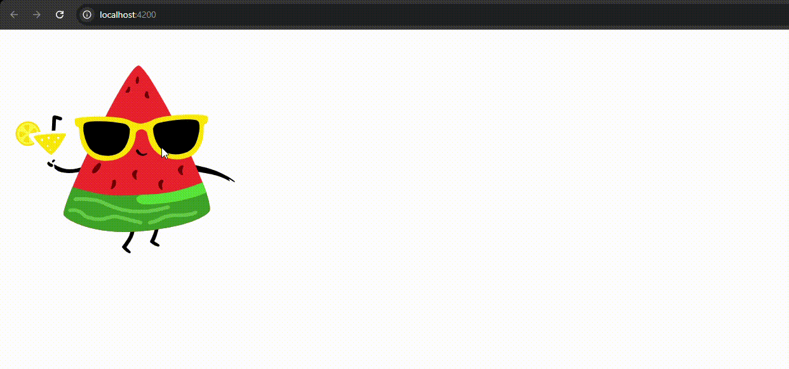

# Angular 18 Project for Testing ngx-lottie Animations

This project was created to test the integration of the ngx-lottie library with Angular 18. It demonstrates how to load and display Lottie animations efficiently within an Angular application.

# Technologies Used

- Angular 18: Framework used for developing the application.
- ngx-lottie: Library for integrating Lottie animations in Angular projects.

## Purpose

The main purpose of this project is to validate the compatibility and performance of using the ngx-lottie library in an Angular 18 environment, providing a foundation for future implementations of animations in more complex projects.

## How to run app

- run `yarn install` ou `npm install`
- run `yarn start`or `npm start` or `ng serve`

## Demo

## Lottie animations

Your can find anothers lottie animations in `https://lottiefiles.com/featured`
 